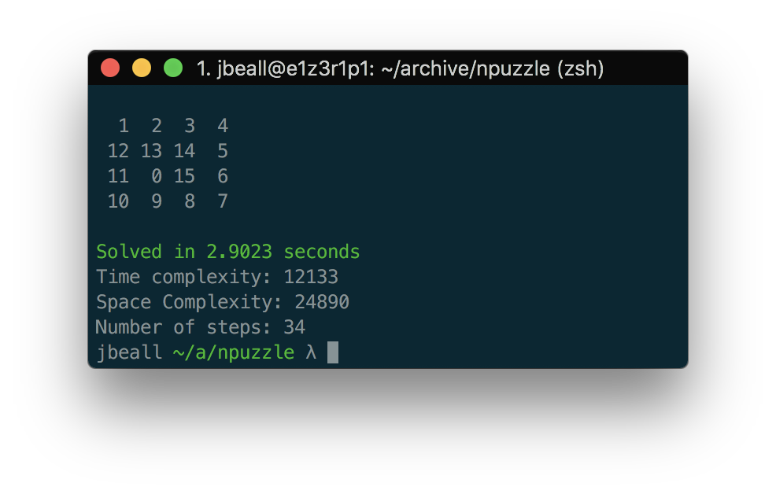

# npuzzle
An n-puzzle solver using A* searching with selectable heuristics for puzzles of size 2 < n < 6.
The project uses A* traversal to find the shortest possible solution for any solvable puzzle. If a puzzle is not solvable the program will notify and terminate. A greedy option will quickly find a solution that is not guaranteed to be the shortest path. A puzzle can be specified from a file or a random puzzle can be generated.

Several heuristics are provided. A fast implementation of the linear conflicts heuristic written in C is included as `fast`.



## Input Files
The first line specifies the dimension of the puzzle.
All following lines declare the puzzle with whitespace delineated numbers.
The '#' character specifies a comment.

The `0` represents the empty square of the puzzle.
```
3       #dimension of puzzle
0 2 1   #puzzle starts here
3 4 5
6 7 8
```

## Requirements
* Python3
* gcc / make / build-essentials (for using fast heuristics)

## Build
`make`

## Usage
usage: `npuzzle.py [-h] [-f {hamming,manhattan,conflicts,fast}] [-g] (-r SIZE | -m MAP)`

optional arguments:

  `-h`, `--help` - show this help message and exit

  `-f` {hamming,manhattan,conflicts,fast} - Specify heuristic function

  `-g`, `--greedy` - Use greedy path finding

  `-r` SIZE - Generate random puzzle of specified size

  `-m` MAP - Read puzzle from file
